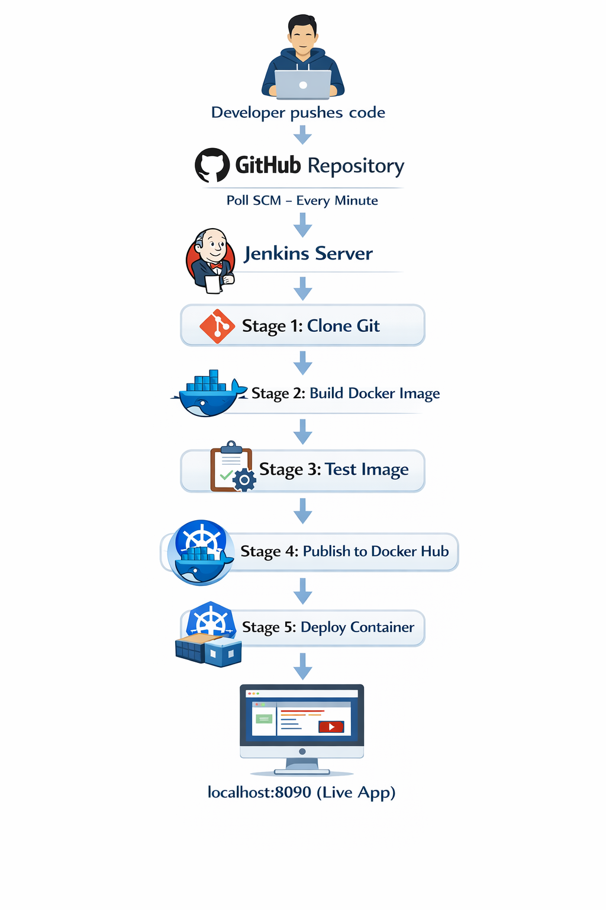

# 🚀 jenkins-docker-cicd

> A fully automated CI/CD pipeline that builds, tests, publishes, and deploys a containerized nginx web application — triggered automatically on every GitHub push.


---

## 📋 Table of Contents

- [Overview](#-overview)
- [Pipeline Architecture](#-pipeline-architecture)
- [Project Structure](#-project-structure)
- [Tech Stack](#-tech-stack)
- [Prerequisites](#-prerequisites)
- [Getting Started](#-getting-started)
- [Jenkins Jobs](#-jenkins-jobs)
- [Pipeline Stages](#-pipeline-stages)
- [Screenshots](#-screenshots)
- [Author](#-author)

---

## 🧠 Overview

This project demonstrates a complete **CI/CD pipeline** built from scratch using Jenkins, Docker, and GitHub. Every time a developer pushes code to the `main` branch, Jenkins automatically:

1. Detects the change via **Poll SCM**
2. Clones the latest code from GitHub
3. Builds a new **Docker image** from the Dockerfile
4. Runs automated **tests**
5. Pushes the image to **Docker Hub**
6. Deploys a new **container** on the local Docker engine

The result: your web application is **live and updated automatically** at `http://localhost:8090` — with zero manual intervention.

---

## 🏗️ Pipeline Architecture

## 

## 📁 Project Structure

```
jenkins-docker-cicd-tp4/
│
├── index.html          # Web application served by nginx
├── Dockerfile          # Docker image build instructions
└── Jenkinsfile         # Pipeline as Code — 5-stage CI/CD definition
```

---

## 🛠️ Tech Stack

| Technology     | Purpose                        | Version |
| -------------- | ------------------------------ | ------- |
| **Jenkins**    | CI/CD Automation Server        | 2.552   |
| **Docker**     | Containerization               | Latest  |
| **nginx**      | Web Server (base image)        | Latest  |
| **GitHub**     | Source Code Management         | —       |
| **Docker Hub** | Container Image Registry       | —       |
| **Groovy**     | Jenkinsfile scripting language | —       |

---

## ✅ Prerequisites

Before running this project, make sure you have:

- [ ] **Jenkins** installed and running at `http://localhost:8080`
- [ ] **Docker Desktop** installed and running
- [ ] **Git** installed
- [ ] A **GitHub** account
- [ ] A **Docker Hub** account
- [ ] Jenkins plugins installed:
  - CloudBees Docker Build and Publish
  - Docker Commons
  - Docker Pipeline

---

## 🚀 Getting Started

### 1. Clone the repository

```bash
git clone https://github.com/YOUHAD08/jenkins-docker-cicd.git
cd jenkins-docker-cicd
```

### 2. Build and run manually (optional test)

```bash
docker build -t jenkins-docker-cicd:latest .
docker run -d --name bdcc-container -p 8090:80 jenkins-docker-cicd:latest
```

Visit `http://localhost:8090` to see the app.

### 3. Set up Jenkins credentials

In Jenkins, add the following credentials:

| ID                      | Type             | Description                  |
| ----------------------- | ---------------- | ---------------------------- |
| `github-credentials`    | Username + Token | GitHub Personal Access Token |
| `dockerhub-credentials` | Username + Token | Docker Hub Access Token      |

### 4. Create the Jenkins Pipeline Job

1. Go to Jenkins → **New Item** → **Pipeline**
2. Set **Poll SCM** to `* * * * *`
3. Set **Pipeline Definition** to `Pipeline script from SCM`
4. Point to this repo and set **Script Path** to `Jenkinsfile`
5. Save and Build!

---

## 🔧 Jenkins Jobs

This TP was built progressively through multiple Jenkins jobs:

| Job                          | Type      | Description                               |
| ---------------------------- | --------- | ----------------------------------------- |
| `project1-job1`              | Freestyle | CI only — build and push to Docker Hub    |
| `project1-job2`              | Freestyle | CI/CD — build, push, and deploy container |
| `project1-job2-script`       | Pipeline  | CI/CD using inline Pipeline script        |
| `project1-job2-jenkins-file` | Pipeline  | CI/CD using Jenkinsfile from GitHub repo  |

---

## 📦 Pipeline Stages

The `Jenkinsfile` defines a **5-stage pipeline**:

### Stage 1 — Cloning Git

Pulls the latest code from the `main` branch of this GitHub repository.

### Stage 2 — Building Image

Builds a Docker image tagged with the Jenkins `$BUILD_NUMBER`:

```
youhad10/jenkins-docker-cicd:BUILD_NUMBER
```

### Stage 3 — Test Image

Runs basic tests to validate the image. Currently echoes `"Tests passed"` — extensible for real test frameworks.

### Stage 4 — Publish Image

Pushes the Docker image to Docker Hub using stored credentials.

### Stage 5 — Deploy Image

Stops and removes any existing container, then runs a fresh container:

```bash
docker stop bdcc-container
docker rm bdcc-container
docker run -d --name bdcc-container -p 8090:80 youhad10/jenkins-docker-cicd:BUILD_NUMBER
```

---

## 🖼️ Pipeline in Action

### Jenkins Dashboard


### Stage View — All 5 Stages Passing


### Docker Hub — Published Images


### Live Application at localhost:8090


---

## 🔑 Key Concepts Demonstrated

- **CI (Continuous Integration)** — Automatic build triggered on every push
- **CD (Continuous Deployment)** — Automatic deployment after successful build
- **Pipeline as Code** — Jenkinsfile stored in version control
- **Containerization** — App packaged as a Docker image
- **Image Registry** — Docker images stored and versioned on Docker Hub
- **Poll SCM** — Jenkins polls GitHub every minute for changes

---

## 👤 Author

**Ayoub Youhad**

- GitHub: [@YOUHAD08](https://github.com/YOUHAD08)
- Docker Hub: [youhad10](https://hub.docker.com/u/youhad10)

---

## 📚 Resources

- [Jenkins Documentation](https://www.jenkins.io/doc/)
- [Docker Documentation](https://docs.docker.com/)
- [Jenkins Pipeline Syntax](https://www.jenkins.io/doc/book/pipeline/syntax/)
- [Docker Hub](https://hub.docker.com/)

---

_Built as part of Master II BDCC — Virtualisation, Cloud Computing & DevOps — TP5_
